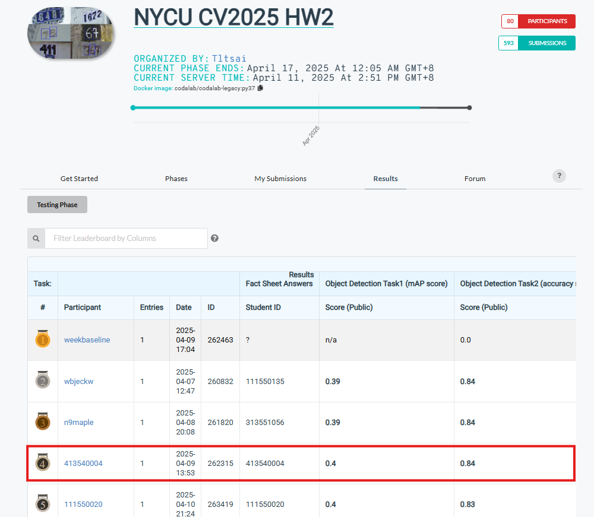

## NYCU Selected Topics in Visual Recognition using Deep Learning 2025 Spring HW2


### Student Information
- **Student ID:** 413540004
- **Student Name:** Phan Nguyen Minh Thao (潘阮明草)

### Introduction
This project implements a digit detection and counting system using the **Faster R-CNN** framework, with a strong emphasis on leveraging the **ResNet-50 v2 + Feature Pyramid Network (FPN)** as the backbone. The goal is to localize and classify digits in real-world RGB images, and to predict the total number of digits present in each image. This work was developed for a deep learning course assignment focused on understanding and modifying object detection models within strict constraints namely, using **Faster R-CNN only** without external datasets.

### Problem Statement

Given an image that may contain multiple digits, the goal is two-fold:

1. **Task1**: The class and bounding box of each digit in the image
2. **Task2**: The number of detected digits in the image

The model must solve these tasks solely using the Faster R-CNN framework. No external datasets or pretrained digit-specific models are allowed.

### Key Features

- **Task1**: The class and bounding box of each digit in the image

- **Task2**: The number of detected digits in the image

- **Backbone: ResNet-50 v2 + FPN**
  - Extracts multi-scale features using a deep residual network.
  - FPN enables better performance on small or overlapping digits.

- **Custom Implementation in PyTorch**
  - Dataset preprocessing, training loop, COCO-style evaluation, and inference are all custom-built.

## Summary

- **Model**: Faster R-CNN
- **Backbone**: ResNet-50 v2 with Feature Pyramid Network (FPN)
- **Framework**: PyTorch (via `torchvision.models.detection`)
- **Evaluation**: COCO-style mAP@0.5
- **Submission**: JSON and CSV outputs zipped

The model architecture follows this pipeline:

**Input Image → ResNet-50 v2 + FPN → Region Proposal Network (RPN) → RoI Pooling → Classification & Regression**

## Model Details

### Backbone: ResNet-50 v2 + FPN

We use the improved ResNet-50 v2 variant, which reorders BatchNorm and activation layers for better convergence. This is combined with a **Feature Pyramid Network (FPN)** to capture multi-scale features, making it particularly effective for small or overlapping digits. Key benefits:
- Deep residual features
- Multi-scale feature representation via FPN
- Pretrained on ImageNet for fast convergence

### Region Proposal Network (RPN)

- Generates anchors at multiple aspect ratios (0.5, 1.0, 2.0) and scales (32–512).
- Proposes object regions for refinement.

### RoI Head

- Applies RoIAlign to pool features.
- Uses a custom classifier (`FastRCNNPredictor`) for 11 classes (digits 0–9 + background).

## Project Structure

```bash
Homework2/
├── 413540004.py # Training script
├── 413540004_submission.py # Inference and submission script
├── pred.csv # Digit string predictions
├── pred.json # Bounding box predictions (COCO format)
├── results/ # TensorBoard logs & saved models
├── tensorboard/ # TensorBoard logs
```
## Dataset

- Format: COCO-style annotations (`train.json`, `valid.json`)
- Images: RGB format
- Split:
  - Train: 30,062 images
  - Validation: 3,340 images
  - Test: 13,068 images


### How to install

#### Installation & Dependencies
Ensure you have Python 3.9+ installed. Install the required dependencies:
- **Python**: 3.9.21
- **NumPy**: 2.0.2
- **Pandas**: 2.2.3
- **PyTorch**: 2.5.1+cu124
- **Torchvision**: 0.20.1+cu124
- **Transformers**: 4.49.0
- **Datasets**: 3.2.0
- **Evaluate**: 0.4.3
- **Timm**: 1.0.15
- **Pycocotools**==2.0.8
- **Pillow**==11.1.0

#### Environmental Settings

The following dependencies and hardware configurations are used in this project:

#### Hardware Environment

- **GPU**: NVIDIA GeForce RTX 3090 (24GB VRAM)
- **CPU**: 48 Cores
- **OS**: Ubuntu 20.04.6 LTS

### Running the Script

This project includes two main Python scripts:

- `413540004.py` – for training
- `413540004_submission.py` – for testing and generating submission files

#### Training the Model

```bash
python 413540004.py -e 20 -l 0.001 -m Resnet50_v2 -b 6
```

#### Inference & Submission
After training, run the following to generate prediction files:

```bash
python 413540004_submission.py -w path_to_trained_model.pth
```
This generates:
- pred.csv: Digit string predictions
- pred.json: COCO-style bounding boxes
- A zipped folder ready for submission

### Performance snapshot

