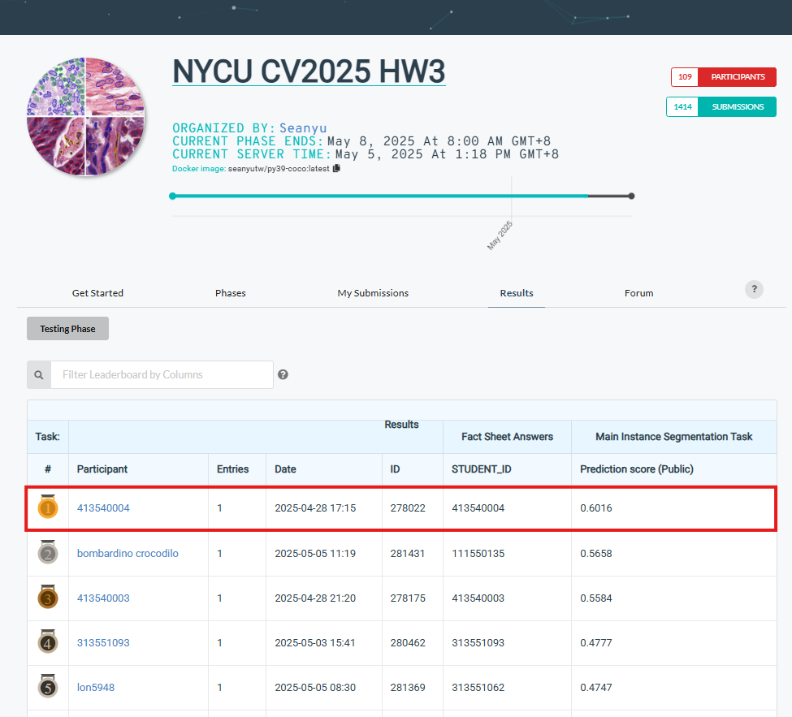

## NYCU Selected Topics in Visual Recognition using Deep Learning 2025 Spring HW3


### Student Information

- **Student ID:** 413540004
- **Student Name:** Phan Nguyen Minh Thao (潘阮明草)

### Introduction
This homework tackles the task of instance segmentation on medical cell images, aiming to identify and segment four types of cells using a Mask R-CNN model. The task aligns with the CodaBench competition setup, and the goal is to achieve the highest AP score possible while maintaining code quality and reproducibility.

#### Installation & Dependencies
Ensure you have Python 3.9+ installed. Install the required dependencies:

- Python: 3.9.21
- PyTorch: 2.5.1+cu124
- NumPy: 2.0.2
- Pandas: 2.2.3
- Pycocotools: 2.0.8
- Detectron2: 0.6
- OpenCV: 4.11.0
- scikit-image: 0.24.0
- pyyaml: 6.0.2

### Model Details

- Backbone: ResNet-101
- Neck: Feature Pyramid Network (FPN)
- Head: Mask R-CNN
- Input Resize: Shortest edge: 608, max size: 800
- Augmentations: Random Brightness, Crop, Flip, Resize
- Batch Size: 8
- Optimizer: SGD with LR 0.01
- Classes: 4 cell types (plus background)

### Data Preparation

#### Input Format

Training data is organized in:

```bash
hw3-data/
└── train/
    ├── [image_name]/
    │   ├── image.tif
    │   ├── class1.tif
    │   ├── class2.tif
    │   └── ...
└── test_release/
    └── [image_name].tif
└── test_image_name_to_ids.json
```

#### Annotation Generation

Run the following to create training annotations:

```bash
python 413540004_annot.py
```

It generates a COCO-style annotation file: train__annot.json

### Training

Run the main training script:

```bash
python 413540004.py -e 20 -l 0.01 -m mask_rcnn_R_101_DC5_3x -b 8
```

- Register the dataset
- Load pre-trained Mask R-CNN model from Detectron2 model zoo
- Perform training with data augmentation
- Save logs and config in tensorboard/ folder

### Evaluation and Submission

Generate predictions using the trained model:

```bash
python 413540004_submission.py \
  --model_path path/to/model_final.pth \
  --config_path path/to/config.yaml
```

The script outputs:
- test-results.json: Required by CodaBench
- A zipped version of the result for submission

### Performance snapshot
