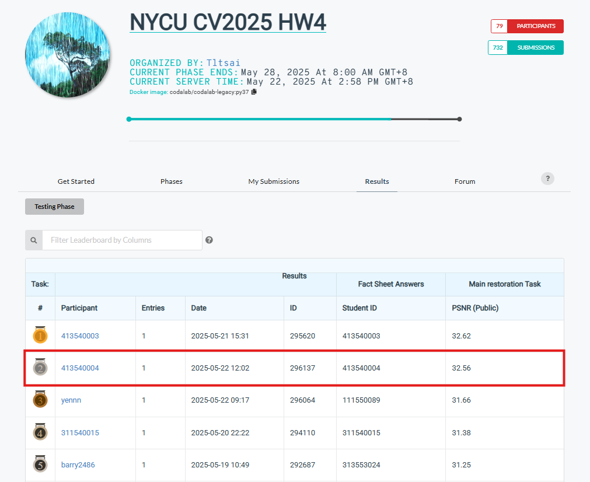

## NYCU Selected Topics in Visual Recognition using Deep Learning 2025 Spring HW4


### Student Information

- **Student ID:** 413540004
- **Student Name:** Phan Nguyen Minh Thao (潘阮明草)

### Introduction
Blind image restoration aims to recover high-quality images from degraded ones without knowing the degradation type. PromptIR introduces a novel prompt-based Transformer that learns adaptive restoration patterns for multiple degradations simultaneously. It achieves strong generalization and high-quality output using a multi-stage Transformer encoder-decoder structure.

#### Installation & Dependencies
Ensure you have Python 3.9+ installed. Install the required dependencies:

- Python: 3.9.21
- PyTorch: 2.5.1+cu124
- NumPy: 2.0.2
- Lightning: 2.0.1
- Pillow:9.4.0
- Piq: 0.8.0
- Einops: 0.6.0
- Scikit-image: 0.19.3

### Model Details

The PromptIR model is composed of the following components:
- Overlap Patch Embedding: Extracts low-level features from input.
- Hierarchical Transformer Encoder: Multi-scale attention for feature extraction.
- PromptGen Modules: Learn task-aware prompts that guide each decoding stage.
- Hierarchical Decoder: Reconstructs clean images from latent features.
- Refinement Module: Final output enhancement using Transformer blocks.

### Data Preparation

#### Input Format

Training data is organized in:

```bash
hw4-data/
├── train/
│   ├── degraded/
│   │   ├── rain-000.png
│   │   ├── snow-001.png
│   ├── clean/
│   │   ├── rain_clean-000.png
│   │   ├── snow_clean-001.png
├── test/
│   └── degraded/
│       ├── rain-100.png
│       ├── snow-200.png
```
**Note**:

- Training set uses ```bash degraded/``` and corresponding ```bash clean/``` images.
- Filenames must follow the pattern:
```bash rain-xxx.png``` → ```bash rain_clean-xxx.png```
```bash snow-xxx.png``` → ```bash snow_clean-xxx.png```

### Training

Run the following command to train on derain and desnow tasks:

```bash
python 413540004.py \
  --epochs 200 \
  --batch_size 4 \
  --lr 2e-4 \
  --de_type derain desnow \
  --patch_size 128 \
  --num_workers 4 \
  --ckpt_dir train_ckpt
```

- Checkpoints are saved in ```bash train_ckpt/```
- Logs are saved to ```bash logs/``` for TensorBoard visualization

### Evaluation

After training, use the validation set performance to evaluate the model:

Validation results include:

- PSNR (Peak Signal-to-Noise Ratio)
- SSIM Loss
- Total Loss (L1 + SSIM)

These are automatically logged using ```bash LightningModule.log```.

### Submission

To generate predictions on the test set and prepare the submission:

```bash
python 413540004_submission.py \
  --test_path hw4-data/test/degraded/ \
  --output_path output \
  --ckpt_dir train_ckpt \
  --ckpt_name model.ckpt
```

Outputs:

- Restored images saved in ```bash output/```

- ```bash pred.npz``` file containing test images in ```bash .npz``` format

- Zipped version: ```bash output/YYYYMMDD__HHMMSS.zip```

### Performance snapshot


### Acknowledgements

This project is based on the [PromptIR](https://github.com/va1shn9v/PromptIR)  architecture from the original paper. We thank the authors for their insightful work.