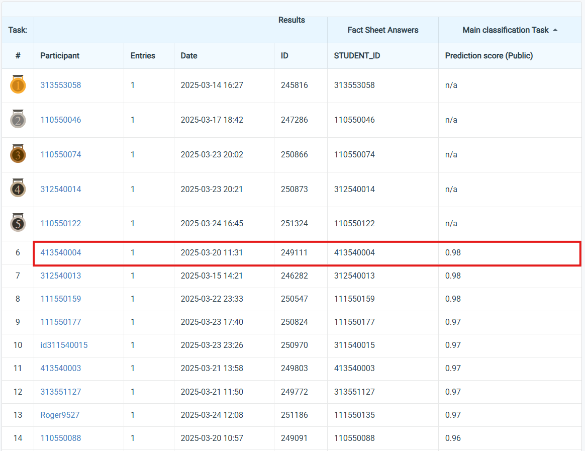

## NYCU Selected Topics in Visual Recognition using Deep Learning 2025 Spring HW1


### Student Information
- **Student ID:** 413540004
- **Student Name:** Phan Nguyen Minh Thao (潘阮明草)

### Homework Overview
This project implements an Image Classification Model using PyTorch, Hugging Face Transformers, and TIMM models. The objective is to classify images into 100 categories using a ResNet-based deep learning model. The training process involves data preprocessing, model fine-tuning, hyperparameter optimization, and evaluation.

### Introduction
In this homework, I implemented and optimized the SE-ResNeXt-aa101d_32x8d architecture using PyTorch and Timm to classify 21,024 training and validation images across 100 categories. Through systematic exploration of preprocessing techniques, optimization strategies, and hyperparameter configurations, this study establishes an effective methodology for complex image classification tasks. By examining different components within the classification pipeline, this research provides insights into their impact on model performance and generalization capability. The findings have implications beyond this specific task, extending to broader applications of deep learning in image analysis, particularly for fine-grained visual discrimination across multiple categories.

### How to install

#### Installation & Dependencies
Ensure you have Python 3.9+ installed. Install the required dependencies:

```bash
pip install timm transformers datasets torch torchvision evaluate tqdm pandas numpy
```
#### Dataset Structure
The dataset should be placed in the data/ directory and follow the ImageFolder format:

```bash
data/
│── train/ (labeled images)
│── validation/
│── test/ (unlabeled images)
```
- Train/Validation Set: 21,024 images
- Test Set: 2,344 images

#### Environmental Settings

The following dependencies and hardware configurations are used in this project:

#### Hardware

- **GPU**: NVIDIA GeForce RTX 3090 (24GB VRAM)
- **CPU**: 48 Cores
- **OS**: Ubuntu 20.04.6 LTS

#### Software & Dependencies
- **Python**: 3.9.21
- **NumPy**: 2.0.2
- **Pandas**: 2.2.3
- **PyTorch**: 2.5.1+cu124
- **Torchvision**: 0.20.1+cu124
- **Transformers**: 4.49.0
- **Datasets**: 3.2.0
- **Evaluate**: 0.4.3

### Data Augmentation Pipelines

Below are the transformation pipelines used for data preprocessing:

#### Training Transformations
```python
train_transforms = Compose([
    RandomResizedCropAndInterpolation(
        size=(288, 288),
        scale=(0.08, 1.0),
        ratio=(0.75, 1.3333),
        interpolation=bicubic
    ),
    RandomHorizontalFlip(p=0.5),
    ColorJitter(
        brightness=(0.6, 1.4),
        contrast=(0.6, 1.4),
        saturation=(0.6, 1.4),
        hue=None
    ),
    MaybeToTensor(),
    Normalize(
        mean=tensor([0.4850, 0.4560, 0.4060]),
        std=tensor([0.2290, 0.2240, 0.2250])
    )
])

```

#### Validation/Testing Transformations
```python
val_transforms = Compose([
    Resize(size=303, interpolation=bicubic),
    CenterCrop(size=(288, 288)),
    MaybeToTensor(),
    Normalize(
        mean=tensor([0.4850, 0.4560, 0.4060]),
        std=tensor([0.2290, 0.2240, 0.2250])
    )
])


```


### Running the Script

Run the training script with default settings:
```bash
python 413540004.py
```

Modify hyperparameters via command-line arguments:
```bash
python 413540004.py --epochs 25 --lr 0.001 --model_name timm/seresnextaa101d_32x8d.sw_in12k_ft_in1k_288 --batch_size 64
```

### Performance snapshot

